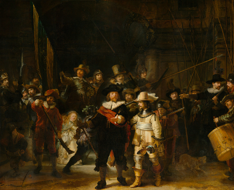

- worker Fetch art from X API
- cli Apply the Wallpaper

##### Dependencies

    # Poetry
    pip3 install poetry

    # Packages
    poetry install

#### Quickstart

    python -m worker.worker config

    python -m worker.worker  launch

#### Run CLI Demo

    python -m cli.index test

“... was developed using the [Rijksmuseum API](https://rijksmuseum.github.io/)
”
